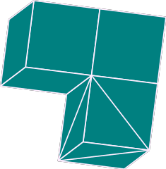
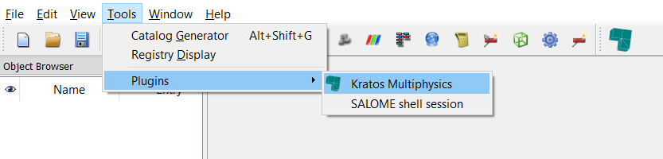

# Kratos Salome Plugin

[![Release][release-image]][releases] [![License][license-image]][license] [![Github CI][CI-image]][CI-link]

[release-image]: https://img.shields.io/badge/release-1.0.0-green.svg?style=flat
[releases]: https://github.com/philbucher/KratosSalomePlugin/releases

[license-image]: https://img.shields.io/badge/License-BSD%203--Clause-blue.svg
[license]: https://github.com/philbucher/KratosSalomePlugin/blob/master/LICENSE

[CI-image]: https://github.com/philbucher/KratosSalomePlugin/workflows/Plugin%20CI/badge.svg
[CI-link]: https://github.com/philbucher/KratosSalomePlugin/actions?query=workflow%3A%22Plugin+CI%22

Plugin for the [SALOME platform](https://www.salome-platform.org/) with which it can be used as preprocessor for the finite element programm [KratosMultiphysics](https://github.com/KratosMultiphysics/Kratos).
An overview of the currently supported Kratos-Applications can be found [here](kratos_salome_plugin/applications).

#### Note:
This plugin is currently work in progress. Furthermore it is more research oriented, which means that the user has to have more knowledge of Kratos itself.
For a more consolidated solution please check the [GiD interface](https://github.com/KratosMultiphysics/GiDInterface).

## Overview
- [How does it work?](#how-does-it-work)
  - [GUI mode](#gui-mode)
  - [TUI mode](#tui-mode)
- [Examples](#examples)
- [Documentation](#documentation)
- [Setup](#setup)
  - [Minimum supported version](#minimum-supported-version)

## How does it work?
Salome offers two ways of creating models; with and without graphical user interface, the **GUI** (graphical user interface) mode and the **TUI** (text user interface, batch) mode respectively. See [here](https://www.salome-platform.org/user-section/faq/faq#_faq_003_07) for an explanation of the TUI mode and [here](https://www.salome-platform.org/user-section/faq/faq#_faq_003_08) for an explanation of the differences between GUI and TUI.\
The plugin can be used in both modes.

### GUI mode
**UNDER DEVELOPMENT**\
In this mode the plugin extends the Salome GUI by using the [python plugin functionalities](https://docs.salome-platform.org/9/gui/GUI/using_pluginsmanager.html#) that Salome provides. It is purely Python based, which means that Salome does not have to be compiled. It is sufficient to install Salome as explained [here](documentation/install_salome.md) and set up the plugin by following the instructions in the [Setup section](#Setup).

### TUI mode
In addition to creating models through the GUI, Salome also provides a way of creating models through scripting in Python,  by exposing the C++ API to Python (Kratos works the same way). Salome examples can be found [here](https://www.salome-platform.org/user-section/tui-examples).\
It is very suitable e.g. for creating models with different levels mesh refinements, see [this example](tui_examples/flow_cylinder).
Three ways of executing the TUI-scripts exist:
  - The Salome GUI offers to load TUI-scripts directly with `File/Load Script ...`. This will execute the script while loading it. It is recommended to use this only for small models, since the output cannot be controlled as good as with the second option.
  - Same as above, but instead of the entire TUI-script which can contain expensive operations, only the Plugin related part can be loaded. This way it is possible to use the GUI and only export the meshes using the Plugin.
  - Running Salome in batch mode without launching the GUI is the recommended way for executing TUI-scripts. Some information can be found [here](https://stackoverflow.com/questions/13266480/running-salome-script-without-graphics). The script [execute_in_salome.py](execute_in_salome.py) can be used for this purpose.

Internally the plugin works with meshes created in the _Mesh_ module of Salome. For more information check the [Documentation](documentation).

A third option is to use this plugin without Salome and creating the mesh manually. This can be done for simple problems like beam-structures.

## Examples
Examples for the **GUI** of the plugin can be found under *kratos_salome_plugin/applications/APP_NAME/examples*.
They can also be loaded inside the plugin after loading the corresponding Application.

The **TUI** examples can be found [here](tui_examples)

Also the [tests](tests) contain usage examples.

## Documentation
The documentation can be found in [Documentation](documentation).

## Setup
  - Get Salome from <https://www.salome-platform.org/>. Usually it is enough to download and unpack it. For more information check the [installation guide](documentation/install_salome.md).

  - Get the plugin by cloning this repo.

  - For using the plugin in the **GUI** mode:
    - Set the environment variables for using the plugin:
      - _Windows_

          Add an [environment variable](https://www.computerhope.com/issues/ch000549.htm) named`SALOME_PLUGINS_PATH` pointing to the directory where the code was cloned to.
          E.g. `C:\Users\<Username>\KratosSalomePlugin`

      - _Linux_

          Add an environment variable named `SALOME_PLUGINS_PATH` pointing to the directory where the code was cloned to.
          E.g. `export SALOME_PLUGINS_PATH="${HOME}/KratosSalomePlugin"`\
          Use `echo SALOME_PLUGINS_PATH="${HOME}/KratosSalomePlugin" >> ~/.bashrc` to directly add it to your `bashrc`

    - In Salome: Click `Tools/Plugin/Kratos Multiphysics` in order to load the plugin.\
        Also a small icon with which the plugin can be loaded appears in the menu list: 
        \
        In case the icon does not appear, check `View/Toolbars/Plugins`

  - For using the plugin in the **TUI** mode:
    - use `sys.path.append("path/to/plugin/KratosSalomePlugin")` before importing anything from the plugin

### Minimum supported version
- **Salome**: The minimum supported version is Salome **9.3**. Check the [developer guide](documentation/developer_guide.md#minimum-supported-version) for details. The versions of Salome that are tested to work can be found [here](kratos_salome_plugin/version.py), but this doesn't mean that other/newer versions don't work.
- **Python**: Salome 9 uses Python 3.6, this is the officially minimum supported version. Currently also Python 3.5 is supported, but this will be dropped in the future.

<!-- ## Quick start
how to start ...
Maybe add a video? -->

<!--
## Contributors
The initiator and main developer of this Plugin is [Philipp Bucher](https://github.com/philbucher).

## Acknowledgements -->
