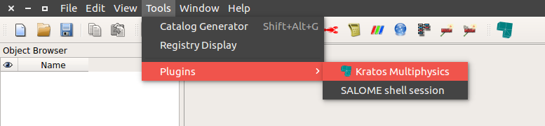

# Kratos Salome Plugin
  

Plugin for the [SALOME platform](https://www.salome-platform.org/) with which it can be used as preprocessor for the finite element programm [KratosMultiphysics](https://github.com/KratosMultiphysics/Kratos).
An overview of the currently supported Kratos-Applications can be found [here](kratos_salome_plugin/applications).

#### Note:
This plugin is currently work in progress. Furthermore it is more research oriented, which means that the user has to have more knowledge of Kratos itself.
For a more consolidated solution please check the [GiD interface](https://github.com/KratosMultiphysics/GiDInterface).

## How does it work?
Salome offers two ways of creating models; with and without graphical user interface, the **GUI** mode and the **TUI** mode respectively.\
The plugin can be used in both modes.

- **GUI mode** <<<**CURRENTLY UNDER DEVELOPMENT**>>>\
In this mode the plugin extends the Salome GUI by using the [python plugin functionalities](https://docs.salome-platform.org/9/gui/GUI/using_pluginsmanager.html#) that Salome provides. It is purely Python based, which means that Salome does not have to be compiled. It is sufficient to install Salome as explained [here](documentation/install_salome.md) and set up the plugin by following the instructions in the [Setup section](#Setup).

- **TUI mode**\
Besides creating models through the GUI, Salome also provides a way of creating models through scripting in Python,  by exposing the C++ API to Python (Kratos works the same way). Salome examples can be found [here](https://www.salome-platform.org/user-section/tui-examples).\
It is very suitable e.g. for creating models with different levels mesh refinements, see [this example](tui_examples/flow_cylinder).

Internally the plugin works with meshes created in the _Mesh_ module of Salome. For more information check the [Documentation](documentation)

## Examples
Examples for the **GUI** of the plugin can be found under *kratos_salome_plugin/applications/APP_NAME/examples*.
They can also be loaded inside the plugin after loading the corresponding Application.

The **TUI** examples can be found [here](tui_examples)

Also the [tests](tests) contain usage examples.

## Setup
  - Get Salome from <https://www.salome-platform.org/>. Usually it is enough to download and unpack it. For more information check the [installation guide](documentation/install_salome).

  - Get the plugin by cloning this repo.

  - For using the plugin in the **GUI** mode:
    - Set the environment variables for using the plugin:
      - _Windows_

          Add an [environment variable](https://www.computerhope.com/issues/ch000549.htm) named`SALOME_PLUGINS_PATH` pointing to the directory where the code was cloned to.
          E.g. `C:\Users\<Username>\KratosSalomePlugin`

      - _Linux_

          Add an environment variable named`SALOME_PLUGINS_PATH` pointing to the directory where the code was cloned to.
          E.g. `export SALOME_PLUGINS_PATH="${HOME}/KratosSalomePlugin"`\
          Use `echo SALOME_PLUGINS_PATH="${HOME}/KratosSalomePlugin" >> ~/.bashrc` to directly add it to your `bashrc`

    - In Salome: Click `Tools/Plugin/Kratos Multiphysics` in order to load the plugin.\
        Also a small icon with which the plugin can be loaded appears in the menu list: 
        \
        In case the icon does not appear, check `View/Toolbars/Plugins`

  - For using the plugin in the **TUI** mode:
    - use `sys.path.append("path/to/plugin/KratosSalomePlugin")` before importing anthing from the plugin

#### Minimum supported version
The oldest supported version is Salome **9.3**. Check the [developers guide](documentation/developers_guide.md#minimum-supported-version) for details.

<!-- ## Quick start
how to start ...
Maybe add a video? -->

<!--
## Contributors
The initiator and main developer of this Plugin is [Philipp Bucher](https://github.com/philbucher).

## Acknowledgements -->
