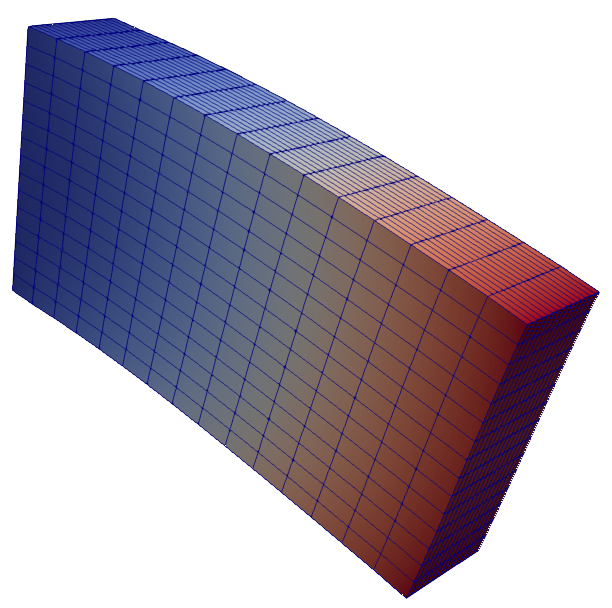

This example represents a simple cantilever beam, fixed on one side and loaded on the other side
It is modelled once with hexahedral and once with tetrahedral solid elements

Execute Salome with: `python3 ../../../tests/execute_in_salome.py ~/software/SALOME/SALOME-9.3.0-UB16.04-SRC/salome salome_cantilever_hexa.py`
And then run Kratos