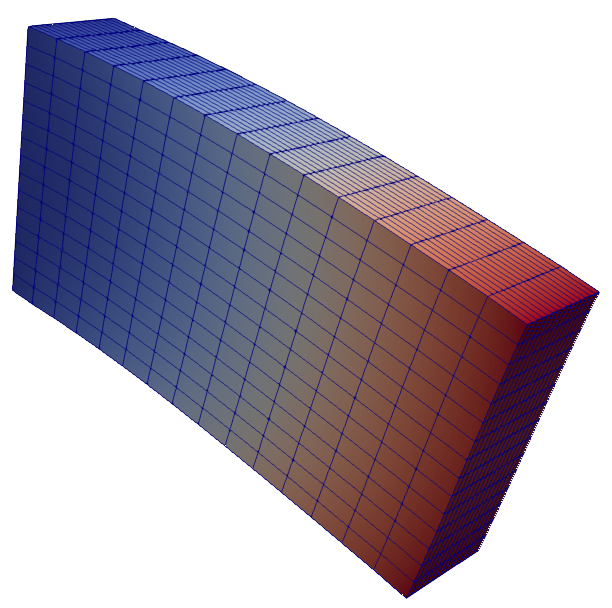
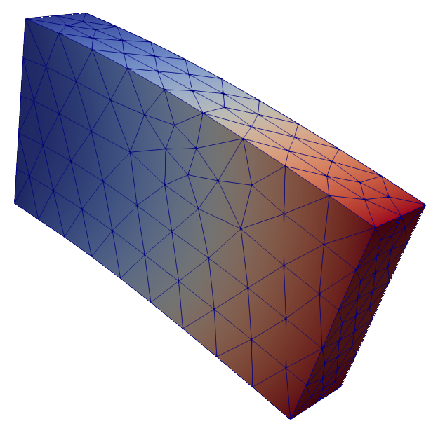

## Cantilever

This example represents a simple cantilever beam, fixed on one side and loaded on the other side\
It is modelled once with hexahedral and once with tetrahedral solid elements.

Hexahedral Elements

Tetrahedral Elements

After executing Salome with either `salome_cantilever_tetra.py` or `salome_cantilever_hexa.py` the provided Kratos files can be used to run this example.
