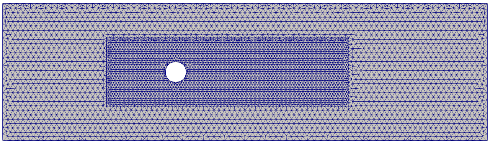
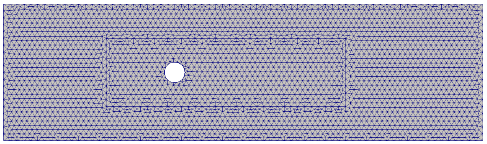
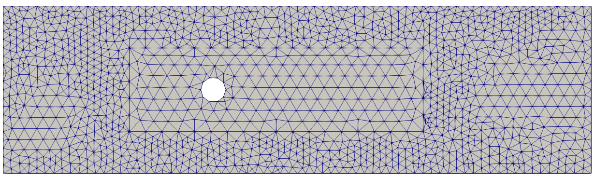

## Flow Cylinder

This example shows a 2D cylinder flow. Meshes with different refinements are created in the same model

### Mesh refinements:
Fine Mesh

Medium Mesh

Coarse Mesh

After executing Salome with `salome_model.py` the three different `mdpa` files are created and the provided Kratos files can be used to run this example.
