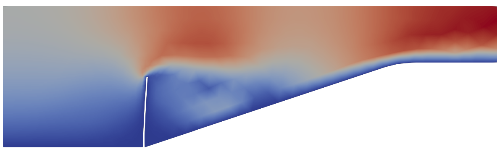

## Mok FSI benchmark

This example shows the Mok FSI benchmark, see the [original dissertation, chapter 7.3](http://dx.doi.org/10.18419/opus-147).

After executing Salome with `salome_model.py` the `mdpa` files for the fluid and the structure domain are created and the provided Kratos files can be used to run this example.
The mesh sizes can be adjusted using the variables at the top of `salome_model.py`.

More information can be found in the [examples repository of Kratos](https://github.com/KratosMultiphysics/Examples/blob/master/co_simulation/validation/fsi_mok/README.md).
