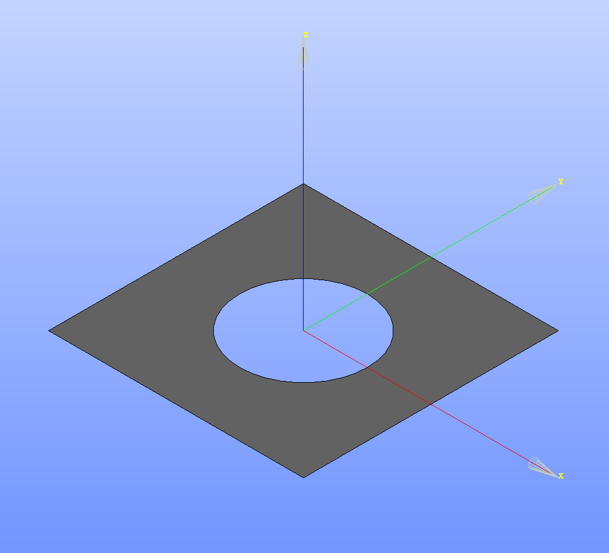

## Shell

The example represents a simple shell model, fixed on one side and loaded on the other side.

## Workflow

This example shows how to use the KratosSalomePlugin to create a .mdpa file as a post-processing step to the graphical setup of the geometry and mesh in the Salome GUI.

The geometry and mesh is already created and stored in the `plate_with_hole.hdf` Salome file.

Geometry

Mesh

Using the `Entry` values of the Salome mesh objects, the .mdpa modelpart is set up in the `create_mdpa.py` script.

`Entry` values in the object browser

### Instructions
**Note:** The script is executed from the working directory of Salome. Therefor it is necessary to specify **absolute paths** to the KratosSalomePlugin and the desired output folder in the `create_mdpa.py` script.

* Open the `plate_with_hole.hdf` in Salome
* Execute `create_mdpa.py` script in the Salome GUI with `File`-`Load Script`.
* The .mdpa file is created together with the other provided input files for Kratos, the simulation can be run.
